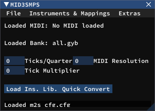
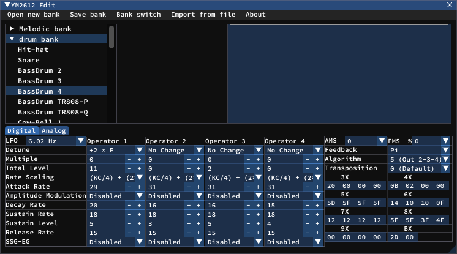

# MID3SMPS: /oerg version coming never... probably
MID3SMPS is a (currently work in progress) update to the classic mid2smps, 
rewritten in modern C++ with the goal of being more flexible with its output and adding quality of life features.

## Features
- [x] Cross-platform (Windows and Linux; OSX untested)
- [ ] Custom instrument banks/folders
- [ ] Instrument reordering
- [ ] SMPS format customization - Convert to S1, S2, S3K and (probably) anything in between
- [ ] Theme customization - Dark mode by default
- [x] Automatic config loading based on previously used config
- [ ] New flexible instrument bank format
- [ ] Plugin API to allow converting to format+s other than SMPS or for custom drivers
- [ ] And every feature described in its companion midi driver [here](https://github.com/lilggamegenius/MDMidi)

## Screenshots

## FAQIJMU (Frequently asked questions I just made up)

Will this support mid2smps file formats?
: Yes. It will support importing all its files, but no exporting is planned (although it wouldn't be hard to add)

Will I be able to convert from formats other than MIDI?
: I'm still debating on whether this is feasible, but I'm hoping to let this be possible through the plugin API. 
It will probably be a while until this is possible, if it ever ends up being possible.

Can I convert to ASM format?
: Yes. I'm still deciding if I want to directly export to ASM, or have somewhere you can pass the path to smps2asm and just use that.

Oerg version? What are you talking about?
: [reference](https://forums.sonicretro.org/index.php?threads/xm3smps-oerg-v3-6-we-get-signal.17759/)

## Contributing
PRs are encouraged and welcomed. The project is pretty new right now, so it regularly goes through many large changes. 
If you do want to contribute something, please make an issue or a draft PR first to make sure there isn't a pending large change.
clang-tidy and clang-format files are provided to make maintaining code style easier and for avoiding subtle bugs.

## Feature Requests
If you have an idea for a feature, put it up on the issue tracker and tag it as "enhancement". 
Try to describe what you want with as much detail as you can to make it easier to understand what exactly you're wanting.